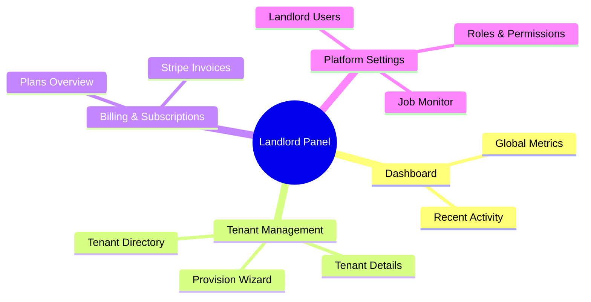
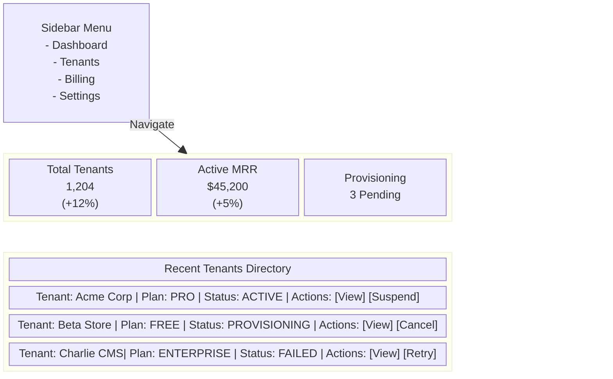
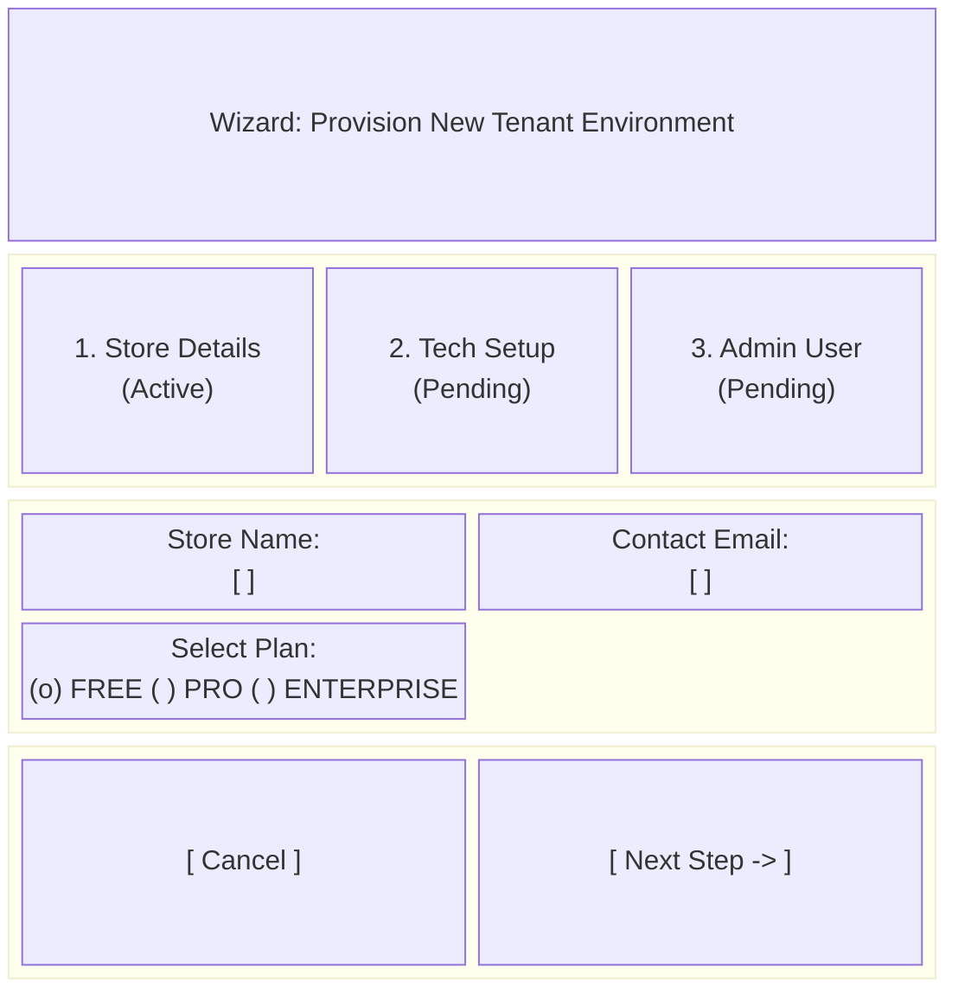
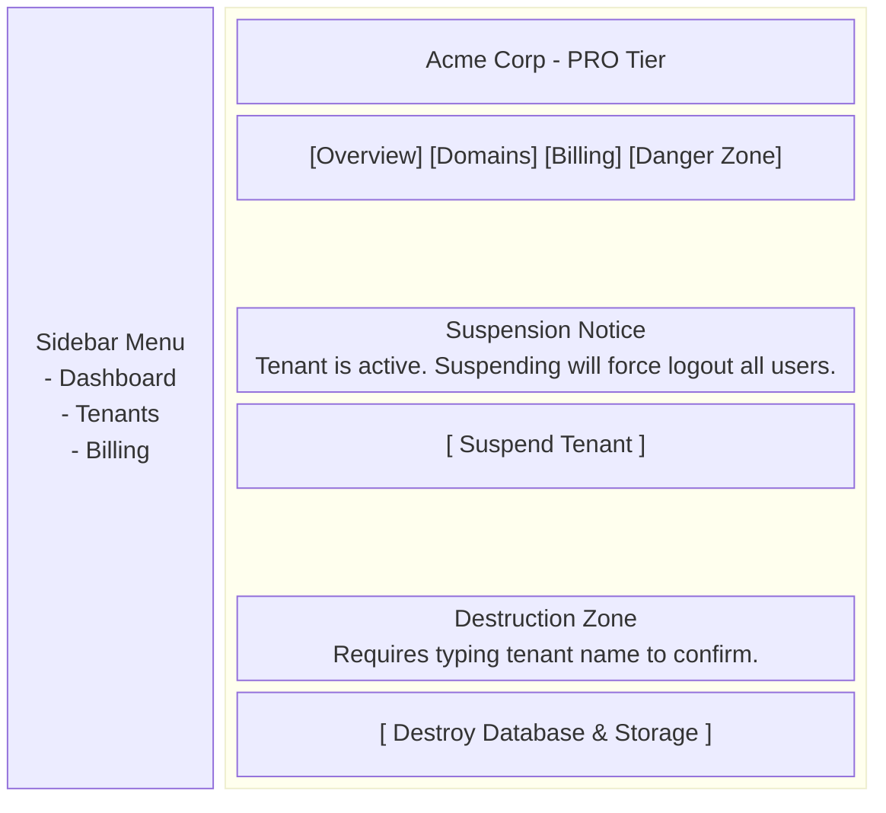

# Landlord Admin Application Proposal

## 1. Technology Stack Recommendation

**Recommended Stack:** **Laravel Filament** (TALL Stack: Tailwind CSS, Alpine.js, Laravel, Livewire)

**Rationale:**
The backend logic is heavily reliant on Laravel's core features—Eloquent state machines, Spatie Multitenancy, Laravel Cashier, and Pipeline-driven asynchronous workflows. Adopting Laravel Filament as the primary interface for Platform Admins (LandlordUsers) provides several massive advantages:
- **Native Eloquent Integration:** Directly manipulates the `Tenant`, `LandlordUser`, and RBAC models on the `landlord` database connection without needing an intermediary REST or GraphQL API.
- **Rapid UI Construction:** Delivers a premium, highly interactive SPA-like experience using Livewire, with hundreds of pre-built, beautifully designed UI components (Tables, Forms, Widgets).
- **Pipeline & Job Synchronization:** Filament's native notification and job monitoring system pairs flawlessly with the `provisioning_status` lifecycle, easily polling and updating the UI when a `BuildTenantEnvironmentJob` completes.
- **Unified Security Model:** Easily restricts access using the existing `landlord` authentication guard and Spatie Roles & Permissions.

*Alternative Considerations:* A Next.js SPA or Vue Inertia application could be used. However, replicating the deep domain validation and routing logic in a separate JavaScript frontend would introduce significant overhead and duplicate the state machine logic already cleanly encapsulated in Laravel.

---

## 2. Information Architecture (Sitemap/Navigation)

The Admin Application will be structured around managing the global lifecycle of the platform.



### Primary Navigation Nodes
1. **Dashboard:** High-level overview of system health.
2. **Tenants:** The core directory for searching, filtering, and managing tenant lifecycles.
3. **Billing:** Stripe integration views for overriding plans or managing disputes.
4. **Access Control:** Managing `LandlordUser` accounts and Spatie roles.

---

## 3. Key Views & Domain Logic Mapping

The UI screens will map one-to-one with the actions defined in `ARCHITECTURE.md`.

### A. Global Dashboard
- **Visuals:** Top row of metric cards (Total Tenants, Active Tenants, MRR). A prominent data chart showing tenant acquisition over time.
- **Functionality:** Highlights tenants that are currently in `pending` or `provisioning` states. If a tenant has a `failed` provisioning status, it surfaces an alert to the admin to investigate the pipeline failure.

### B. Tenant Directory
- **Visuals:** A comprehensive data table.
- **Filters:** By `TenantPlan` (FREE, PRO, ENTERPRISE), Operational Status (`is_active`), and `provisioning_status`.
- **Backend Mapping:** 
  - **Suspend Action:** A bulk or row-level action triggering the `SuspendTenantAction` (Executes the `DeactivateTenantRecord` -> `TerminateTenantSessions` pipeline).
  - **Reactivate Action:** Triggers the `ReactivateTenantAction`.
  - **Destroy Action:** Placed behind a strict confirmation modal. Triggers the `DestroyTenantEnvironmentAction` (Pipeline: `DeleteTenantRecord` -> `DeleteTenantStorageDirectory` -> `DropTenantDatabase`).

### C. Tenant Provisioning Wizard (Create Form)
- **Visuals:** A sleek, step-by-step wizard.
- **Backend Mapping:** Instantiates a `ProvisionTenantData` DTO.
  - **Step 1:** Core Details (`name`, `email`, `plan`).
  - **Step 2:** Technical Setup (`domain`, auto-generates `database` name).
  - **Step 3:** First Admin Account (`TenantAdminUserData` DTO capturing name, email, and temporary password).
- **Execution:** Submitting the wizard triggers the `ProvisionNewTenantAction`, pushing the model into `pending` state and dispatching the `BuildTenantEnvironmentJob`.

### D. View Tenant (Infolist)
- **Visuals:** A detailed resource view with tabs for configuration.
- **Domain Tab:** Provides a form to trigger the `UpdateTenantDomainAction` (Pipeline: `ValidateDomainAvailability` -> `UpdateTenantRecord` -> `UpdateWebserverConfig`).
- **Billing Tab:** Interfaces with the `BillingProvider` (Stripe Cashier) to show active subscriptions, past due invoices, and payment methods.

---

## 4. Visual Mockups

> [!NOTE]
> Below are structural wireframe representations of the key screens designed to convey the layout, user flow, and component hierarchy.

````carousel
### Screen 1: Main Tenant Dashboard

<!-- slide -->
### Screen 2: Tenant Provisioning Wizard

<!-- slide -->
### Screen 3: Tenant Details & Danger Zone

````

### Action Plan
If this proposal is approved, the immediate next steps would be:
1. Initialize the Laravel Filament panel with the `landlord` auth guard.
2. Build the `TenantResource` reflecting the Directory and View logic.
3. Implement the `Provisioning Wizard` utilizing Filament's native form actions to construct the necessary `ProvisionTenantData` DTOs and dispatch the pipeline jobs.
